# Scalable URL Shortener (Iterative Development)


[](LICENSE)


A high-performance, reactive URL shortener built with **Kotlin Coroutines** and **Spring WebFlux**. 

```mermaid
graph TD
    classDef core fill:#d4e6ff,stroke:#2c3e50,stroke-width:2px,rx:10,ry:10,color:#1a2634;
    classDef port fill:#fff2cc,stroke:#d4a017,stroke-width:2px,stroke-dasharray: 5 5,rx:15,ry:15,color:#7d5d0b;
    classDef adapter fill:#d5f0d5,stroke:#1e7e1e,stroke-width:2px,rx:12,ry:12,color:#0b4f0b;
    classDef db fill:#f0d0ff,stroke:#6a1b9a,stroke-width:2px,rx:20,ry:20,color:#38006b;

    Client([🌐 Client / Browser]) -->|HTTP WebFlux| Controller

    subgraph Primary [📤 Primary Adapters]
        Controller[🔗 LinkController]:::adapter
    end

    subgraph Hexagon [🧠 Application Core / Domain]
        Controller -->|suspend call| Service(⚙️ LinkManagerService):::core
        Service -->|uses| CachePort[[💾 CachePort]]:::port
        Service -->|uses| RepoPort[[📁 LinkRepositoryPort]]:::port
    end

    subgraph Secondary [📥 Secondary Adapters]
        RedisAdapter[🔴 RedisCacheAdapter]:::adapter -.->|implements| CachePort
        PgAdapter[🐘 PostgresRepositoryAdapter]:::adapter -.->|implements| RepoPort
    end

    subgraph External [☁️ External Infrastructure]
        RedisAdapter -->|Reactive Redis| Redis[(🔥 Redis)]:::db
        PgAdapter -->|Spring Data R2DBC| PostgreSQL[(🗄️ PostgreSQL)]:::db
    end
```



## The Philosophy: Overcoming Perfectionism
This project follows the **Walking Skeleton** pattern and **Iterative Delivery**. 
Instead of over-engineering from day one, this repository starts with a clean, perfectly abstracted **Hexagonal Architecture (Ports and Adapters)**. The core business logic is completely decoupled from the infrastructure. 

Currently, it runs as a blazing-fast MVP with In-Memory adapters. As the project evolves, we will swap these dummy adapters with enterprise-grade infrastructure (see Roadmap) *without touching a single line of the core domain logic*.

## Current Features (v0.3.0 - Scalable Read Layer)
* **Distributed Cache Layer:** Redis Cluster integration via `CachePort`.
* **Read Optimization:** O(1) redirect performance for hot links.

## Quick Start

1.  **Run the application:**
```Bash
./gradlew bootRun
```

2.  **Test the APIs:**
If you are using Neovim (`kulala.nvim` / `rest.nvim`), IntelliJ IDEA, or VS Code, simply open `api.http` and click run!
    
_Alternatively, using cURL:_
```Bash
# Create a short link
curl -X POST http://localhost:8080/api/v1/links \
   -H "Content-Type: application/json" \
   -d '{"originalUrl": "https://github.com/masterj3y/url-shortener", "userId": 1024}'
```
    

## Roadmap & System Design Evolution

This project is a playground for advanced distributed system concepts. Watch this space as we scale:

-   [x] **Phase 1: The Foundation** (Kotlin, Coroutines, Hexagonal Architecture, In-Memory MVP)
-   [x] **Phase 2: Persistent Storage** (Docker Compose, PostgreSQL, R2DBC integration)
-   [x] **Phase 3: High-Performance Read Layer** (Redis Cluster integration via `CachePort`)
-   [ ] **Phase 4: Polyglot Microservice** (Migrating the read/redirect heavy lifting to a bare-metal **Rust + Tokio** HTTP server)
-   [ ] **Phase 5: Key Generation Service (KGS)** (Solving the Base62 collision problem with a dedicated pre-generation worker)
-   [ ] **Phase 6: Event-Driven Analytics** (Introducing **Kafka** for async events and **Cassandra** for billion-scale click tracking)
-   [ ] **Phase 7: Horizontal Scaling** (PostgreSQL Sharding using **Citus** and Consistent Hashing)
    
----------

## License

This project is licensed under the GNU Affero General Public License v3.0.
See the LICENSE file for details.

----------

_Built with ❤️ and pragmatic engineering._
